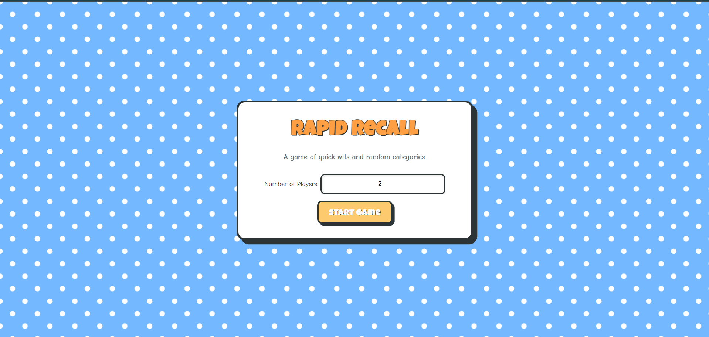
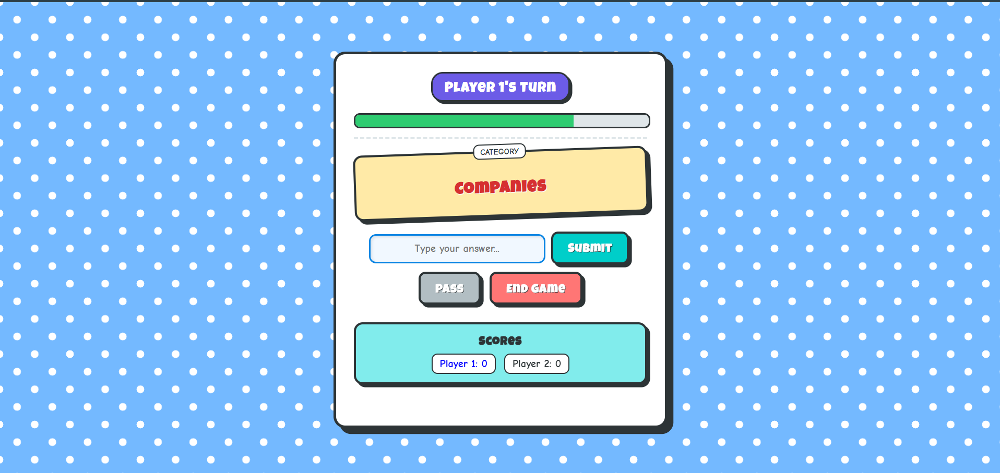
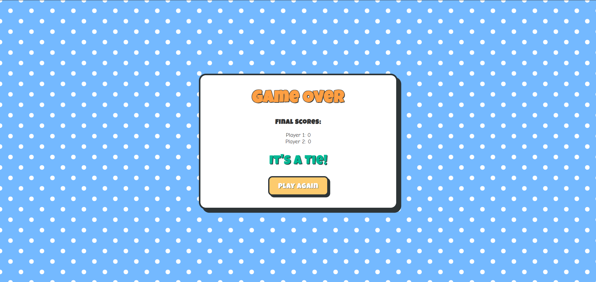

# 🧠 Rapid Recall

Rapid Recall is a **multiplayer browser-based recall game** where players take turns naming words from randomly selected categories within a limited time.  
The game tests **memory, quick thinking, and knowledge** while keeping track of scores and enforcing rules like duplicate prevention.

---

## 🎮 Game Overview

In each round:

1. A **random category** is selected.
2. A player has **15 seconds** to type a valid answer belonging to that category.
3. If the answer is correct and **not previously used**, the player earns a point.
4. The turn moves to the **next player**.
5. The game continues until players decide to end it, and the **winner is determined by the highest score**.

---

## 📸 Game Screenshots

### Start Screen


### Gameplay


### Winner Screen


## ✨ Features

- 👥 **Multiplayer Support** – play with multiple players
- 🎯 **Random Category Selection** every turn
- ⏱ **15-second countdown timer** for each player
- 🔁 **Duplicate answer prevention**
- 📊 **Live scoreboard updates**
- 🏆 **Automatic winner detection**
- ⚡ **Keyboard support** (press Enter to submit answer)

---

## 🛠 Tech Stack

- **JavaScript** – game logic and state management  
- **HTML** – UI structure  
- **CSS** – styling and layout  

---

## 📂 Project Structure

```
rapid-recall
│
├── index.html        # Main game interface
├── style.css         # Game styling
├── script.js         # Core game logic
├── categories.js     # Category word database
└── assets/           # Images or UI assets
```

---

## 🚀 How to Run the Game

1. Clone the repository

```
git clone https://github.com/deebyanshujha/rapid-recall.git
```

2. Open the project folder.

3. Open **index.html** in your browser.

4. Enter the number of players and start playing.

---

## 🎯 Game Rules

- Each player gets **15 seconds** to answer.
- Answers must belong to the **current category**.
- **Previously used answers are not allowed**.
- Correct answers give **+1 point**.
- The player with the **highest score wins**.

---

## 💡 Future Improvements

- Add **difficulty levels**
- Add **online multiplayer**
- Add **leaderboard storage**
- Add **sound effects and animations**
- Add **mobile-friendly UI**

---

## 👨‍💻 Author

**Deebyanshu Jha**  
B.Tech CSE (IoT) – VIT Vellore

GitHub:  
https://github.com/deebyanshujha